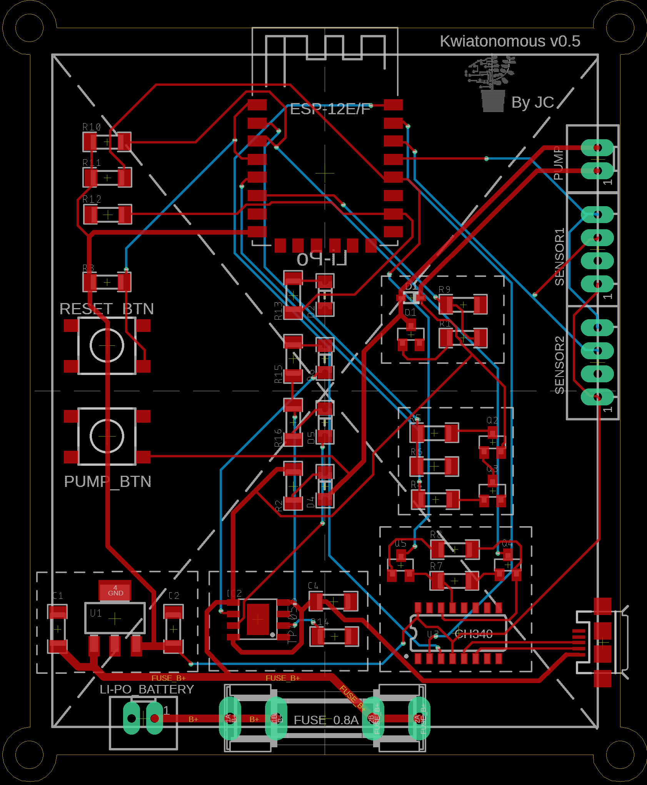
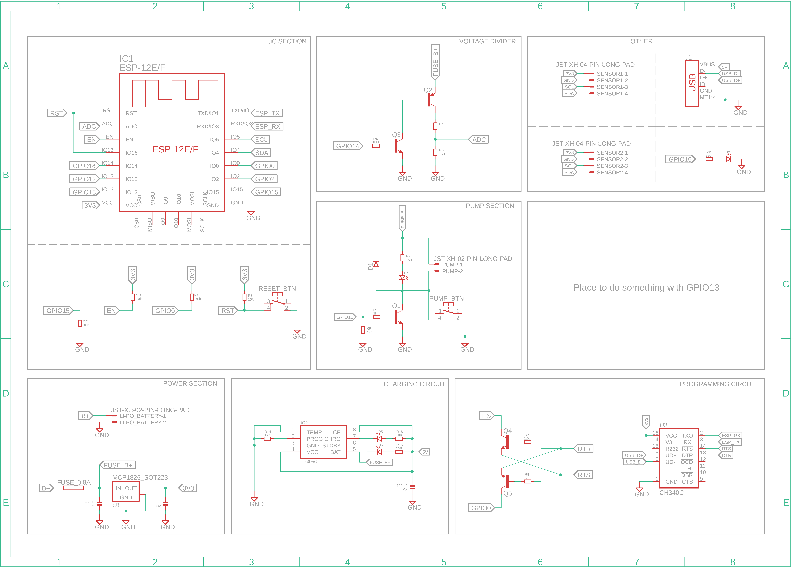

# Kwiatonomous-v2 

##### Kwiatonomous is a device for automatic plant watering. ESP8266 based, battery powered (super low power), own backend (in Ktor) and Android app (with Jetpack Compose).

___

### Android App

  

___

### Hardware
#### v0.5 (306070 Li-Po)

  
  

  
v0.4 (Li-ion 18650)

  

    
    
  

___

### CAD
#### Case for v0.5 PCB

  

___

🔥 More comming soon 🔥

