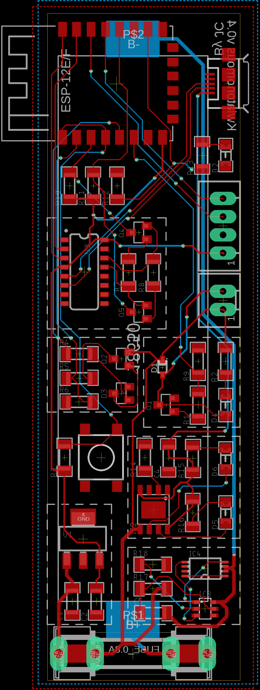
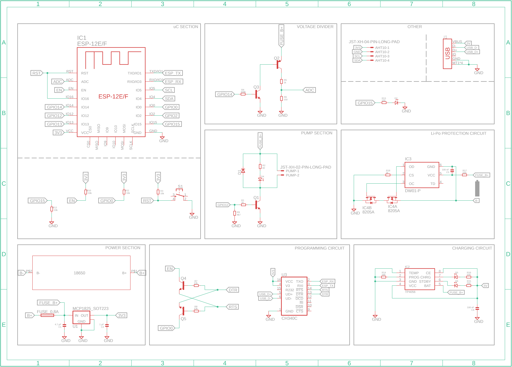

# Kwiatonomous-v2 

##### Kwiatonomous is an over-engineered device for automatic plant watering. ESP8266 based, battery powered (super low power), own backend (in Ktor) and Android app (with Jetpack Compose).

___

### Android App

___

### Hardware

___

🔥 More comming soon 🔥

