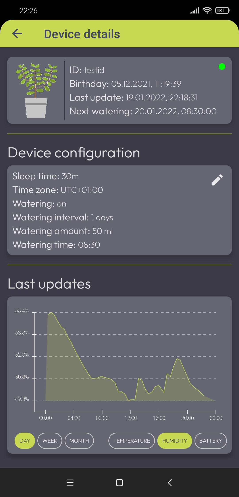

# Kwiatonomous-v2			

###### Kwiatonomous is an over-engineered device for automatic plantwatering. ESP8266 based, battery powered (super low power), own backend (in Ktor) and Android app (with Jetpack Compose).
------------

### Screen shots

